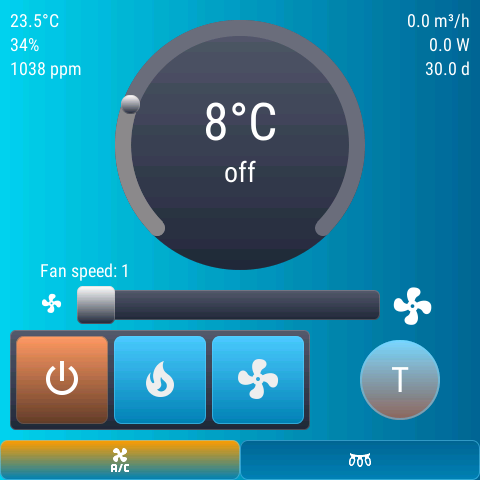
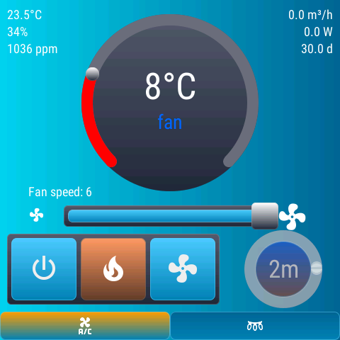
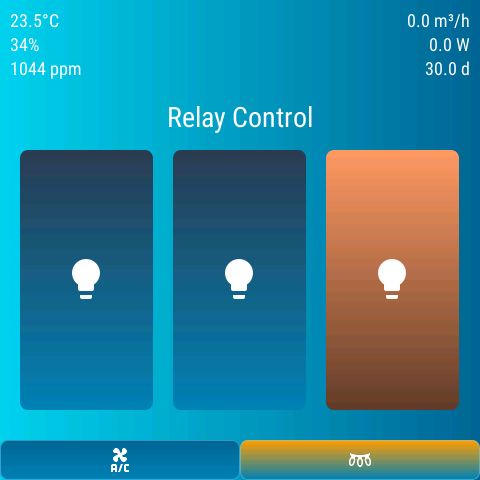

# ESP32-S3 OpenHASP Tion 4S Controller

Ansible playbook для конфигурирования тач-скрин устройства ESP32-S3 с прошивкой OpenHASP для управления бризером Tion 4S и другими устройствами через Home Assistant.

## Основные возможности
- **Мульти-устройство**: Управление неограниченным количеством панелей OpenHASP.
- **Автоматическая загрузка**: Загрузка разметки (`pages.jsonl`) на устройства через HTTP API.
- **Интеграция с HA**: Автоматический деплой конфигураций в Home Assistant через SSH.
- **Гибкая настройка**: Индивидуальные сенсоры и сущности для каждой панели. Позволяет отображать информацию с любых датчиков и устройств Home Assistant в углах страниц.
- **Установка HACS**: Опциональная автоматическая установка HACS на сервер Home Assistant.
- **Многостраничность**: Поддержка нескольких страниц управления с глобальной навигацией.

## Скриншоты и описание интерфейса

Интерфейс панели разделен на глобальные элементы (отображаются всегда) и функциональные страницы.

### Глобальные элементы (Page 0)
Эти элементы видны на любой выбранной странице:
- **Информационные панели (углы)**: Отображение данных с любых датчиков Home Assistant (температура, влажность, CO2, мощность, ресурс фильтра и др.).
- **Панель навигации (низ)**: Таб-бар высотой 40px для быстрого переключения между разделами. Активный раздел подсвечивается оранжевым цветом.
  - Иконка `\uE01B`: Переход к управлению климатом.
  - Иконка `\uF2BA`: Переход к управлению реле.

### Страница 1: Управление климатом (Tion 4S)
Предназначена для полного контроля бризера:
- **Центральная арка**: Установка целевой температуры.
- **Индикаторы в центре**: Текущая температура и активный режим (heating/fan).
- **Слайдер**: Ручная регулировка скорости вентилятора (1-6).
- **Матрица кнопок**: Выбор режима работы (Выкл, Обогрев, Только вентиляция).
- **Кнопка "Т" (Boost)**: Активация режима "Турбо". При включении отображает оставшееся время и круговой индикатор прогресса.




### Страница 2: Управление встроенными реле
Позволяет управлять силовыми выходами устройства:
- **Вертикальные кнопки**: Три крупные кнопки для управления встроенными реле.
- **Визуальная обратная связь**: Иконки меняются с `\uE335` (выкл) на `\uE6E8` (вкл), активная кнопка подсвечивается синим фоном и белой рамкой.



## 1. Установка и настройка Ansible

### 1.1. Установка Ansible
Для работы с проектом необходимо установить Ansible на ваш компьютер.
- **Linux**: Следуйте [официальной инструкции для дистрибутивов](https://docs.ansible.com/ansible/latest/installation_guide/installation_distros.html).
- **macOS**: Рекомендуется установка через Homebrew: `brew install ansible`. Подробнее в [документации](https://docs.ansible.com/ansible/latest/installation_guide/intro_installation.html#installing-ansible-on-macos).
- **Windows**: Рекомендуется использовать **WSL** (Windows Subsystem for Linux). Прямая установка на Windows не поддерживается. См. [Ansible on Windows FAQ](https://docs.ansible.com/ansible/latest/os_guide/windows_faq.html#can-i-run-ansible-on-windows).

### 1.2. Установка зависимостей
Проект использует внешние роли и коллекции. Установите их перед запуском:
```bash
cd ansible
ansible-galaxy install -r requirements.yml
```
Подробнее об установке зависимостей см. в [официальной документации Ansible Galaxy](https://docs.ansible.com/ansible/latest/galaxy/user_guide.html#installing-roles-and-collections-from-a-file-requirements-yml).

## 2. Предварительная подготовка

Перед использованием Ansible необходимо подготовить сервер Home Assistant и сами устройства.

### Шаг 1: Подготовка Home Assistant
1. **SSH доступ**: Установите аддон "Advanced SSH & Web Terminal", отключите "Protection mode" и настройте порт 22222 (см. [подробности в Troubleshooting](docs/troubleshooting.md#ошибка-ssh-connection)).
2. **HACS**: Если не установлен, Ansible может сделать это автоматически (см. раздел "Установка HACS").
3. **openHASP**: Через HACS установите компонент версии 0.7.0.
4. **MQTT**: Установите Mosquitto Broker и создайте пользователя (см. [инструкцию по MQTT](docs/mqtt-setup.md)).

### Шаг 2: Подготовка устройства OpenHASP
1. **Прошивка**: Если устройство не прошито, следуйте [руководству по прошивке](docs/device-flashing.md).
2. **WiFi**: Подключите устройство к вашей сети через [AP Mode или серийную консоль](docs/device-flashing.md#начальная-настройка-wifi).
3. **MQTT**: В веб-интерфейсе устройства настройте подключение к HA.
   - **ВАЖНО**: Поле `Hostname` должно совпадать с именем файла в `ansible/host_vars/` (например, `plate01`).

## 3. Конфигурация Ansible

### 3.1. Инвентарь (Inventory)
Проект использует два файла инвентаря для разных задач:
- `ansible/inventory/openhasp_devices`: Список ваших панелей OpenHASP. Используется для генерации конфигов и загрузки на устройства.
- `ansible/inventory/ha_servers`: Данные сервера Home Assistant. Используется для деплоя YAML-файлов через SSH.

### 3.2. Переменные (Variables)
- **Глобальные (`ansible/group_vars/all.yml`)**: Настройки SSH, URL API Home Assistant и параметры HACS.
- **Для устройств (`ansible/host_vars/имя_устройства.yml`)**: IP адрес панели, ID сущностей климата и сенсоров.
  - *Пример*: `ansible/host_vars/plate01.yml` соответствует устройству с Hostname `plate01`.

## 4. Использование Playbook

### 4.1. Основные тэги и этапы
Вы можете запускать как весь процесс целиком, так и отдельные этапы с помощью тэгов:

- `--tags generate`: Только генерация конфигурационных файлов в папку `output/`.
- `--tags upload`: Загрузка файла `pages.jsonl` на устройство через HTTP API (требуется `device.ip` в `host_vars`).
- `--tags deploy`: Копирование YAML-конфигураций на сервер HA через SSH и перезагрузка HA.
- `--tags hacs`: Установка или обновление HACS на сервере HA.

### 4.2. Примеры команд
```bash
cd ansible

# Полный цикл: генерация, загрузка на устройство и деплой в HA
ansible-playbook playbook.yml -i inventory/openhasp_devices -i inventory/ha_servers -e "homeassistant.api_token=ВАШ_ТОКЕН"

# Только генерация и загрузка на конкретное устройство
ansible-playbook playbook.yml -i inventory/openhasp_devices --tags upload -l plate01
```

## 5. Установка HACS
Для автоматической установки HACS используется роль [jhampson-dbre.home_assistant.install_hacs](https://github.com/jhampson-dbre/ansible-role-home-assistant-hacs).
Чтобы включить установку, установите `hacs.enabled: true` в `ansible/group_vars/all.yml` и запустите плейбук с тэгом `deploy` или `hacs`.

## 6. Устранение проблем
При возникновении ошибок (SSH, API, MQTT) обратитесь к разделу [Устранение проблем](docs/troubleshooting.md).

---
Подробную инструкцию по использованию Ansible см. в [docs/ansible-usage.md](docs/ansible-usage.md).
